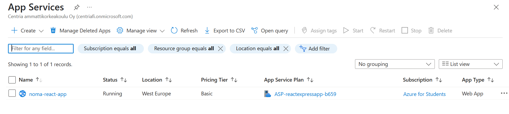
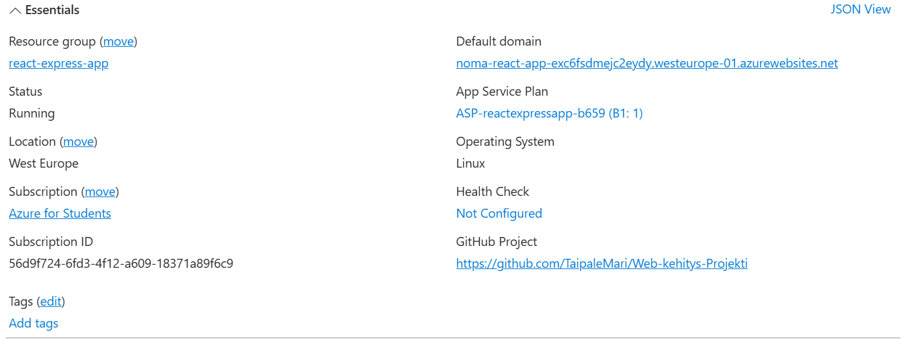

# Perusrunko ja päätoiminnallisuudet

Tässä vaiheessa aloitetaan sovelluksen kehitys ja dokumentoidaan etenemistä vaiheittain tähän dokumenttiin. 

## 2.1. Ympäristö ##

Tässä luvussa kuvaillaan käytetty kehitysympäristö ja projektissa tarvittavien ohjelmien asennus. 
Projekti kehitetään aluksi omalla paikallisella koneella VSCodella ja siirretään Azuren pilvipalveluun myöhemmin, kun backend ja frontend ovat perusrakeenteeltaan valmiit.
Projektin kehittämisessä tarvitaan seuraavia ohjelmia: 
  - Node.js (+express) - Backendin ja frontendin ajamiseen
  - SQLite3 - Tietokanta
  - Git & GitHub - Versionhallintaan
  - VS Code - Koodieditori

  **Node.js** 

Node.js tarvitaan projektissa JavaScriptin ajamiseen ja se on tämän projektin backendin ja frontendin pääajoympäristö. 
    - Asennetaan Node.js virallisilta sivuilta: https://nodejs.org/en
    - Ladattiin uusin versio (LTS) ja asennettiin oletusasetuksilla. 
    - Tarkistetaan asennus komentorivin kautta: node -v ja tarkistetaan, että komento palauttaa versionumeron.

  **SQLite**

Päädyimme käyttämään tietokannassa SQLiteä, koska meillä on pieni kahden hengen kehitystiimi ja työskentelemme pääosin etänä omilla koneillamme.
Valitsemalla SQLiten varmistamme, että molemmat tiimin jäsenet pääsevät helposti käsiksi yhteiseen tietokantaan. 
Emme odota suuria käyttäjä- tai tietomääriä, joten emme tarvitse monimutkaista tietokantarakennetta projektin kehityksen tässä vaiheessa.  

  - Asennettaan SQLite nettisivujen kautta: https://www.sqlite.org/download.html
  - Ladattiin ja asennettiin Windowsin versio sqlite-dll-win-x64-3490100.zip (64-bit DLL)
  - Tarkistetaan asennus komentorivin kautta: sqlite3 --version ja tarkistetaan, että komento palauttaa versionumeron.

**GitHub ja VSCode**

Käytämme projektin versionhallintaan yhteistä GitHub repositorya ja sovelluksen koodaamiseen VSCodea. Tiimin jäsenet päivittävät koodiin tehdyt muutokset GitHubiin, josta
muut jäsenet voivat hakea muutokset omaan kehitysympäristöönsä ja näin molempien koodi pysyy samassa vaiheessa. 

  - GitHub repon osoite: https://github.com/TaipaleMari/Web-kehitys-Projekti
  - kloonataan komennolla: git clone https://github.com/TaipaleMari/Web-kehitys-Projekti.git
  - siirrytään VSCodessa kloonattuun kansioon ja aloitetaan projektin koodin luominen.

*Edit* 15.4.2025 Siirto Azuren pilvipalvelimeen. Kloonattu tämän github-repossa master-haarassa sijaitseva sovellus. Sovellus on Azuressa käynnissä ja saa päivitykset (kts. alta kuvat). Sovelluksen pitäisi toimia osoitteessa: noma-react-app-exc6fsdmejc2eydy.westeurope-01.azurewebsites.net 
Ongelmia vielä toistaiseksi koodissa, koska sovellus ei käynnisty selaimessa oikein. 





## 2.2. Backend ##

Tässä luvussa on kuvattu backend kehityksen vaiheet VSCodessa. Lopuksi sovelluksen koodi on siirretty tähän GitHub projektirepoon, master-haaraan: https://github.com/TaipaleMari/Web-kehitys-Projekti.git  

Sovelluskansion sisään luotu erillinen backend kansio.  VSCoden terminaalissa on navigoitu backend kansioon ja alustetaan uusi Node.js-projekti oletusasetuksilla: ```npm init -y``` 

Asensimme kerralla tarvittavat npm paketit: ```install express sqlite3 bkryptjs jsonwebtoken cors dotenv```
- express = Noden web-sovelluskehys
- sqlite3 = tietokantakäyttö Nodessa
- bcryptjs = salasanojen turvalliseen käyttöön salausfunktiot
- jsonwebtoken = autentikointia varten
- cors = Cross-Origin Resource Sharing -tuki (sallitaan ulkopuolisten verkkosivujen tehdä pyyntöjä)
- dotenv = lataa ympäristömuuttujia .env-tiedostosta


Backend-kansioon luotu server.js tiedosto ja tiedostoon lisätty koodi, joka sisältää rekisteröintireitin, testireitin, käyttäjätietokannan, kirjautumisreitin (sisältää viestin jos salasana tai käyttänimi virheellinen) sekä palvelimen käynnistys (kuuntelee porttia 5000;)

[server.js](https://github.com/TaipaleMari/Web-kehitys-Projekti/blob/master/backend/server.js)

Terminaaliin komento ```node server.js```, selaimella http://localhost:5000/ , saatu viesti selaimeen "backend toimii!"

Backend kansioon luotiin database-kansio ja sen sisään sqliten tietokanta tiedosto: database/users.db.
Backend kansioon tehtiin db.js -tiedosto, joka sisältää tietokantayhteyden server.js tiedostoon. Tämän jälkeen käynnistettiin palvelin uudelleen testataksemme tietokantayhteyden toimivuuden, tarkoituksena saada terminaaliin viesti "yhdistetty sqlite tietokantaan".

Käyttäjän rekisteröinti: lisätty koodia server.js:n, joka mahdollistaa käyttäjän rekisteröimisen. Testattu komentoriviltä rekisteröintiä: cURL-komennolla: ```curl -X POST http://localhost:5000/register \
    -H "Content-Type: application/json" \
    -d '{"username": "testuser", "email": "testuser@example.com", "password": "password123"}'```


## 2.3. Frontend ##

Frontendissä haluamme käyttäjälle seuraavat toiminnallisuudet:
  - etusivulla sisäänkirjautuminen ja linkki rekisteröitymislomakkeelle
  - onnistuneen kirjautumisen jälkeen siirrytään käyttäjän omalle etusivulle, jossa listaus tehtävistä
  - tehtävien merkkaaminen suoritetuksi, tehtävien muokkaaminen ja lisääminen

Frontend kansioon tehtiin register.js-tiedosto ja app.js-tiedosto. 

Terminaalissa annettiin komento: ```react-router-dom``` , joka lataa ja asentaa React-kirjaston. Tämä mahdollistaa sovelluksen eri sivujen navigoinnin ilman, että koko sivu latautuu uudelleen.... tekee sovelluksestamme dynaamisemman käyttää. tarvitsemme tätä ominaisuutta, jotta käyttäjä voi joustavasti muokata omaa tehtävätauluaan. 

Sovelluksen käynnistyessä ensin aukeaa Home.js sivu, josta voi valita siirtymisen edelleen kirjautumiseen (login.js) tai rekisteröitymiseen (register.js)

### Rekisteröinti ###

[Register.js:n koodi](https://github.com/TaipaleMari/Web-kehitys-Projekti/blob/master/frontend/src/pages/Register.js)


### Kirjautuminen ###

Login.js ja yhteys backendiin, jossa varmistetaan, että kättäjä on rekisteröitynyt ja että salasana täsmää käyttäjätunnuksen kanssa. 

[Login.js:n koodi ](https://github.com/TaipaleMari/Web-kehitys-Projekti/blob/master/frontend/src/pages/Login.js)

### Käyttäjän sivu ### 

local storage - koodirivi userDashboard.js:ssä ja App.js:ssä mahdollistaa käyttötietojen säilyttämisen selaimessa. 

userDashboard.js sisältää käyttäjän etusivun ja tehtävien muokkauksen

[userDashboard.js:n koodi](https://github.com/TaipaleMari/Web-kehitys-Projekti/blob/master/frontend/src/pages/UserDashboard.js)


## 2.4. Tietokanta ##

Tietokantana sovelluksella toimii SQLite. Se on kevyt ja helppokäyttöinen ratkaisu paikalliseen kehitykseen. Tietokantaan käyttäjille luodaan taulu, jossa on seuraavat kentät:
  - id INTEGER PRIMARY KEY
  - username TEXT UNIQUE
  - email TEXT UNIQUE
  - password TEXT

Tietokantaan voidaan laajentaa lisäkenttiä, kuten tehtävät ja aikaleimat.
Tietokanta alustetaan automaattisesti db.js-tiedoston kautta, joka yhdistetään backendiin server.js:n.

## 2.5. Perusrakenne ja arkkitehtuuri ##

Backend koostuu: 
  - server.js, joka on sovelluksen pääasiallinen palvelintiedosto. Tämä määrittelee reitit ja käsittelee HTTP-pyynnöt
  - db.js, joka on tietokannan alustamiseen ja taulujen luontiin
  - routes/ , tämä on tulevia reittejä varten
  

Frontend koostuu:
   - App.js, tämä on pääkomponentti ja sisältää reititykset
   - pages/, näissä on rekisteröinti, kirjautuminen, etusivu jne.

Sovelluksen kansiorakenne:


```text
📁 Master-haara
├── 📁 backend
├── 📁 database
├── 📁 node_modules
├── 📁 frontend
│   ├── 📁 public
│   └── 📁 src
│       ├── 📁 pages
│       │   ├── AddTasksForm.js
│       │   ├── Home.js
│       │   ├── Login.js
│       │   └── Register.js
│       ├── UserDashboard.js
│       ├── App.js
│       └── App.css
└── README.md
```


## 2.6. Toiminnot ##

Sovelluskehityksen tässä vaiheessa olemme toteuttaneet seuraavat toiminnallisuudet: 
  - Käyttäjän rekisteröinti ja kirjautuminen
  - JWT-autentikointi backendissä
  - Käyttäjän tehtävien hallinta: lisääminen, muokkaaminen ja suoritetuksi merkkaaminen
  - LocalStorageen tallentaminen

Nämä toiminnallisuudet on testattu ja ne toimivat odotetulla tavalla. Frontendin ja backendin välinen yhteys toimii JSON-pyyntöjen avulla. 

## 2.7. Testaus ja virheenkäsittely ##

Virheenkäsittely on toteutettu backendiin tarkistamalla 
1. onko käyttäjä olemassa
2. täsmääkö salasana
3. ovatko syötetyt kentät tyhjiä

Frontendissä virheviestit ilmestyvät käyttäjälle näkyviin.
Testausta on suoritettu manuaalisesti selaimen kautta testaamalla, että toiminnot toimivat kuten pitää sekä komentorivin kautta cURL:illa. 

JEST TAI CYPRESS KIRJASTOT JOS KERITÄÄN TEHDÄ

## 2.8. Käyttöliittymä ja vuorovaikutus ##

Käyttöliittymä on rakennettu Reactilla. 
